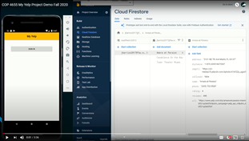

# COP4655YelpApp
## Powered by Yelp Fusion, Google Maps, and Firebase Cloud Firestore

### Demonstration Video
*Click the thumbnail*

### Firebase App Distribution
Want to try out the app for yourself? [Click Here](https://appdistribution.firebase.dev/i/38e54501806ab2ef "Firebase App Distribution Invite") to get the Firebase distribution invite link. (Android only)

### Built with
* Android Studio Java

* [Yelp Fusion API](https://www.yelp.com/developers/documentation/v3 "Yelp Fusion Documentation")

* [Google Maps API](https://developers.google.com/maps/documentation/android-sdk/start#get-key "Google Maps Documentation")

* [Firebase Cloud Firestore](https://firebase.google.com/docs/firestore "Cloud Firestore Documentation")

### Features

* Google Sign In
* Search by type of business or specific business name in combination with city.
* Show first 10 search results on Google Maps
* Show first 10 search results in a list format
* Detailed descriptions for each business result with image
* Favorites List associated with Google Sign In

---
# HW8-5: A sample app